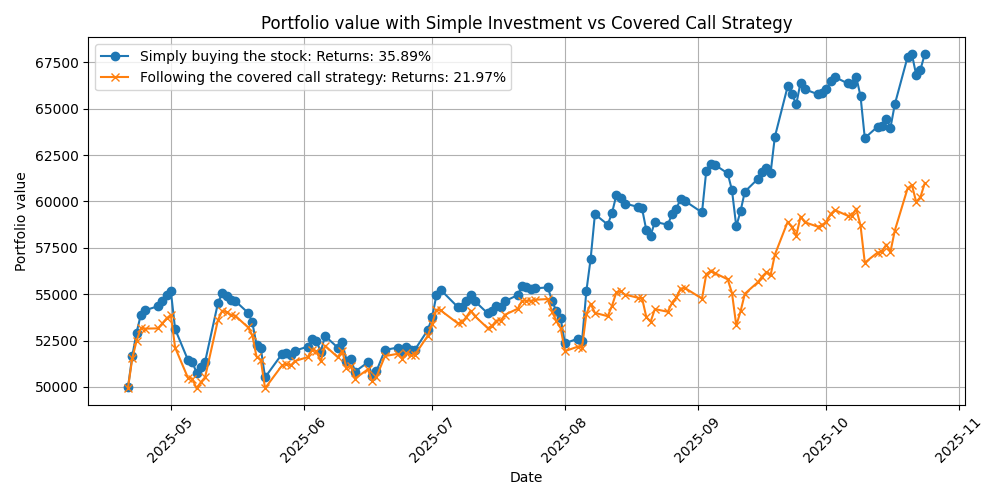

# Auto Daily Covered Call Backtester

A project that automatically fetches live market data each day to perform forward-style backtesting of the covered call strategy.
It updates a CSV file and a performance graph (in the sheets/ folder), allowing you to compare the strategy’s results against a simple buy-and-hold investment in the stock.

## Table of Contents
- [Features](#features)
- [Demo](#demo)
- [Logic flow](#logic-flow)

## Features

- Automatically updates the CSV file each day for the position and the summary of the strategy.
- Automatically updates the graph to compare the strategy against the simple investment.
- Tracks stock price, option position, and unrealized and realized P/L.
- Designed specifically for covered call strategies.
- Simple and extendable Python codebase.

## Demo
- Daily jobs on GitHub action workflow to update CSV files and the graph

- Position file

- Summary file

- Covered Call vs Investment Graph

## Logic flow
- Check whether it's an expiry day, a new day, or in between days.
  - Expiry day: It is the day when the option contract expires. To check whether it is an expiry day or not, we use the option_expiry date from the last position.
  - New day: This is the next trading day after the expiry day. On a new day, we sell new option contracts and buy stocks if we had to sell it on the expiry day. To check whether it is a new day or not, in the position file, we store a boolean value as True on the expiry day to identify it's the new day after the expiry day. After taking the actions, we set isNewDay back to False.
  - In between days: We don't take any actions on these days; we just update the position file, summary file, and graph on these days. If the isNewDay from last position is False, then it's a new day.
 
- If it is an Expiry day.
  - If the stock price has closed above our strike price, we realise the gains for stocks on our strike price and add it to the balance. If not, we don't sell our stock gains, we only update the unrealised gains.
  - We always realise the option gains on expiry day by multiplying the sold option quantity and the last option_sell_price, and add it to the balance.

 - If it is a New day.
   - We check whether our stock quantity is 0 or not; if it is 0, it means we had to sell our stock on the last expiry day. So we buy stocks with the current balance we have.
   - We fetch at-the-money implied volatility, convert it to weekly volatility, and choose an out-of-money strike price based on the calculated volatility for the week.
   - To calculate option quantity, we divide the current stock quantity by 100(lot size for APPL), take the floor, and multiply it by the lot size.
   - We sell the option contract at the bid price(Provided by Yahoo Finance).

- If it is an In-between day.
  - We simply fetch the Stock data, option data for our current strike price, and update unrealised profit/loss.
  - For stock unrealised profit: (Bid_price - Stock_buy_price from the position) * Stock_quantity
  - For option unrealised profit: (Ask_price - Option_sell_price) * Option_sold_quantity

- In the end, we update the position and summary file for the current trading day and save it to the sheets folder.
- We plot the graph from the summary and position file and save it to the sheets folder
- We also update the implied volatility file to track IV of the ATM.

